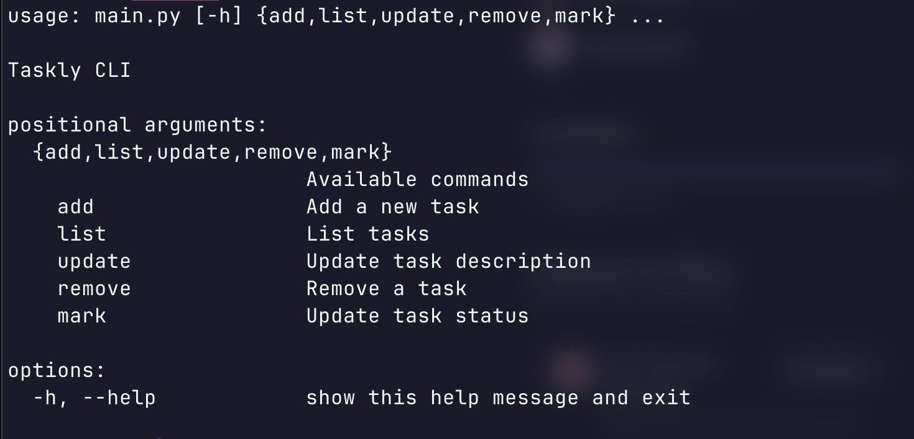

### Taskly
Just a little python CLI for managing TODOs.  Project from Roadmap.SH for learning Python and excercising problem solving (the real skill I need to develop).  

To install, just clone it and go to your terminal and starting using it: `python3 main.py add "The first todo!"`  The program will create a `.taskly.json` file in your home directory (according to `Path.home()` from pathlib).

Discovered the argparse library to create a parser making this.

The list command can take a a --status flag to filter the list. e.g. `main.py list --status pending`

Project description/constraints/etc found at [roadmap.sh](https://roadmap.sh/projects/task-tracker)
